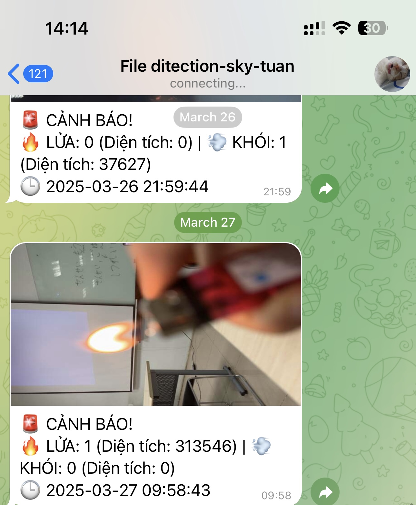

# YOLOv8n-FireDetection
🔥 Real-time fire and smoke detection using YOLOv8n, with Telegram alert integration (image + timestamp).


# YOLOv8n Fire Detection System

A real-time fire and smoke detection system using YOLOv8n, with automated alerts sent to Telegram.

## Features

- Detects fire and smoke in real time using a pre-trained YOLOv8n model.
- Sends alert messages and annotated images via Telegram.
- Stores all detection snapshots locally.
- Easy to configure and run on any system with Python 3.8+.

## Project Structure

```
YOLOv8n-FireDetection/
├── main.py                # Main script to run detection
├── config.py              # Telegram bot configuration
├── telegram_alert.py      # Functions to send alerts to Telegram
├── best.pt                # Pretrained YOLOv8n model
├── requirements.txt       # Python dependencies
├── alert_images/          # Saved detection images
├── README.md              # This documentation
└── images/demo.gif        # Demo image or GIF
```

## Installation

### 1. Clone the repository

```bash
git clone https://github.com/17tuanphamanh/YOLOv9-FireDetection.git
cd YOLOv9-FireDetection
```

### 2. Install dependencies

```bash
pip install -r requirements.txt
```

**Note:** Python 3.8 or higher is required.

## Telegram Configuration

1. Create a Telegram bot via [@BotFather](https://t.me/BotFather).
2. Obtain your bot token and chat ID (use [@userinfobot](https://t.me/userinfobot) to get your chat ID).
3. Edit the `config.py` file and add the following:

```python
BOT_TOKEN = 'your_telegram_bot_token'
CHAT_ID = 'your_telegram_chat_id'
```

## Usage

Run the detection system with:

```bash
python main.py
```

When fire or smoke is detected:
- A message is sent to your Telegram account.
- An image with bounding boxes is saved in the `alert_images/` folder.

## Example Output




## Contributing

Contributions, bug reports, and feature requests are welcome. Feel free to open issues or submit pull requests.

## License

This project is licensed under the MIT License.
